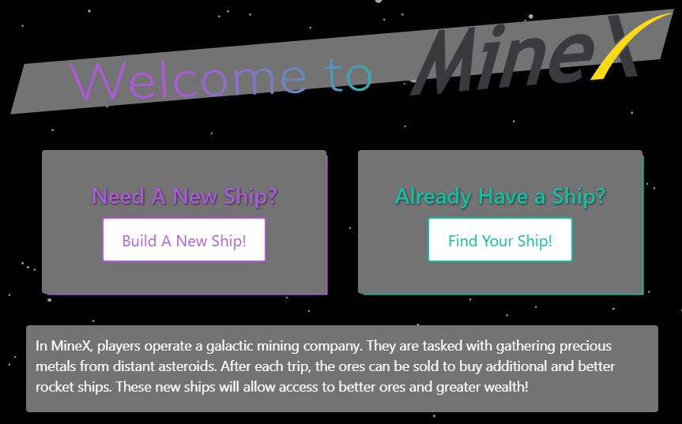
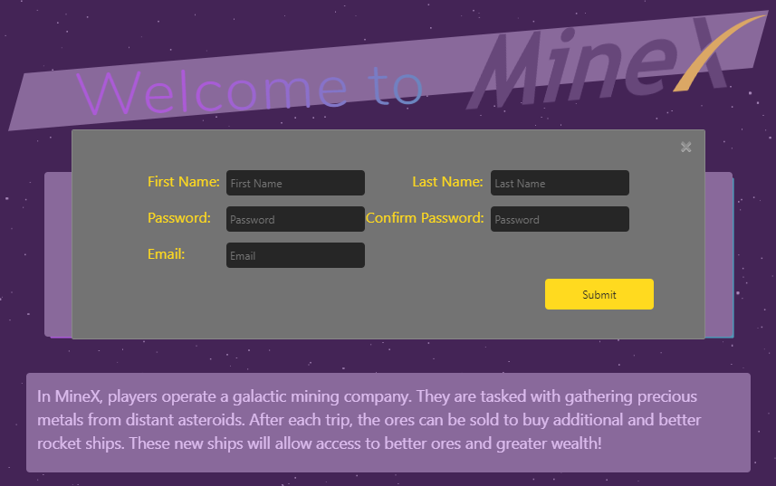
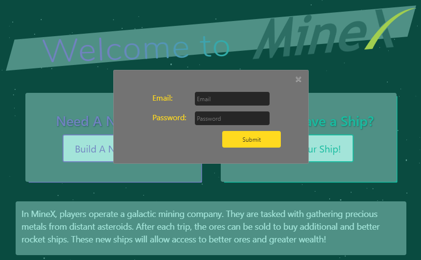
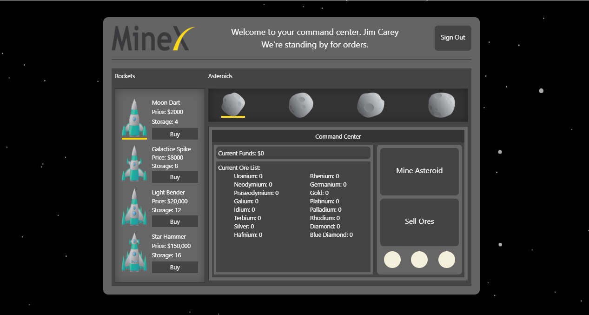

# 
### MineX v1.0
MineX is an online game for mining in space. When an account is created, the player is taken to their control panel where they can set out to gather ores and materials from distant asteroids to earn money. 

Click here to visit the live website:
https://dallin-rodgers-minex.herokuapp.com/

## Table of Content
+ [Introduction](#introduction)
+ [Instructions](#instructions)
+ [Technologies Used](#tecnologies)
+ [Game Features](#features)
+ [Improvements](#improvements)
+ [creators](#contributors)

## <a name="introduction"> Introduction </a>
* Create a spaceship (register) or use an existing spaceship (login) to enter the command center.
* If playing for the first time, you will be provided with a basic spaceship capable of taking you to the nearest asteroid.
* Once on the asteroid, you will gather random precious ores to fill your cargo for the return trip.
* After selling the materials, your account will cummulate to enable you to make upgrades to your spaceship.
* After you upgrade to the next improved vessel, you can travel to further asteroids to gather even more valuable ores.

## <a name="instructions"> Instructions </a>
To get started you will need these applications:
+ [Node](https://nodejs.org/en/download/) 
+ [npm](https://docs.npmjs.com/cli/install)
+ [MySQL](https://dev.mysql.com/downloads/windows/installer/8.0.html)

```
    npm install 

    install dependencies situated in package.json

    "dependencies": {
        "@hapi/joi": "^17.1.0",
        "ajax": "0.0.4",
        "bcryptjs": "^2.4.3",
        "body-parser": "^1.19.0",
        "dotenv": "^8.2.0",
        "express": "^4.17.0",
        "express-handlebars": "^3.1.0",
        "mysql": "^2.18.1",
        "mysql2": "^1.6.5",
        "node": "^13.7.0",
        "nodemon": "^2.0.2",
        "passport": "^0.4.1",
        "passport-local": "^1.0.0",
        "sequelize": "^5.8.6",
        "sql": "^0.78.0"
    }
```
## <a name="technologies"> Technologies Used </a>
* **Express** : Node.js web application framework
* **Express Handlebars** : handlebars view engine for Express
* **Sequelize** : promised-based ORM
* **MySql** : database
* **Bcryptjs** : encrypting passwords with hashing fuctions
* **Passport** : authentication middleware
* **Joi** : schema description language and data validator for JS

## <a name="features"> Game Features </a>
### **Home Page**
Instructions and create/login account.



### **Sign-Up Page**
Create an encrypted account which will be stored in our database.



### **Log-In Page**
Logging-in page



### **Command Center Page**
Command center page of user's account and current status.  



## <a name="improvements"> Improvements </a>
* Work-in-progress for MineX v:2.0
* Implement Passport.js
* Implement Json Web Tokens & introduce cookies
* Refine game dashboard

## <a name="contributors"> Contributors: </a><br />
* Dallin Rodgers - https://github.com/???
* Lewis Lockhart - https://github.com/lewis00001
* Korene Korologos - https://github.com/
* James Goh - https://github.com/jgohbb


